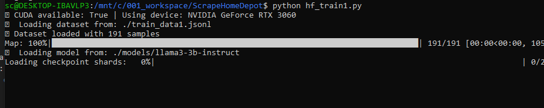

# Multi-Step Fine-Tuning Plan #

https://github.com/brevdev/launchables/blob/main/llama3_finetune_inference.ipynb


## environments: HF and Transformer
(hf_requirements.txt)
!pip install -q -U bitsandbytes
!pip install -q -U git+https://github.com/huggingface/transformers.git
!pip install -q -U git+https://github.com/huggingface/peft.git
!pip install -q -U git+https://github.com/huggingface/accelerate.git
!pip install trl

!pip install -U huggingface_hub
huggingface-cli login (use token to login, )

```
(hf_download.py)
from huggingface_hub import snapshot_download

snapshot_download(
    repo_id="meta-llama/Meta-Llama-3.2-3B",
    local_dir="./models/llama3-3b-instruct",  # Match your current folder layout
    local_dir_use_symlinks=False
)
```

## training

🧪 hf_train1.py (Pilot Phase) or hf_train2.py (continue)

